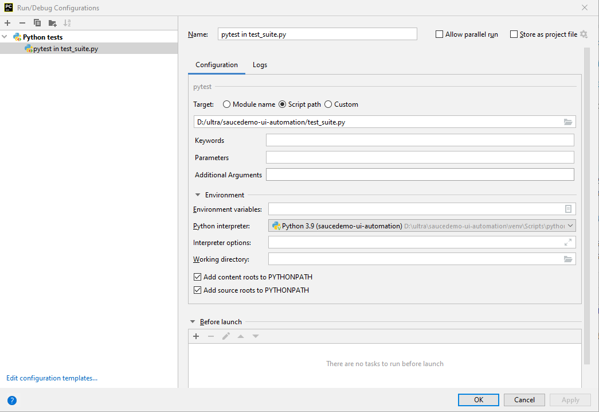

## soucedemo-ui-automation
This project it is written in python, pytest and selenium webdriver, It has been applied the **Page Object Model** pattern.

### Reqiremens
1. UI automation:
   1. Use https://www.saucedemo.com/
   2. Use standard_user
   3. Build a UI framework using your preferred programming language (JS preferred; Java, C#, Python, etc. accepted as well)
   4. Automate the purchase flow
   5. Provide the readme to the solution
   6. Upload the solution to a private repo on either gitlab or github

### Test Flow
The purchase testing flow was created.
<details>
   <summary>click to expand "Purchase testing flow"</summary>

    ```
    def test_purchase_flow(self):
        login_page = LoginPage(self.driver)
        login_page.login(username='standard_user', password='secret_sauce')

        products_page = ProductsPage(self.driver)
        self.assertTrue(products_page.page_should_be_loaded())
        products = products_page.get_products_list()
        items_to_shopping_cart = products_page.add_to_shopping_cart(products)

        header_bar_component = HeaderBar(self.driver)
        header_bar_component.click_on_shopping_cart()

        cart_page = CartPage(self.driver)
        items_from_shopping_cart = cart_page.get_cart_items()
        self.assertTrue(cart_page.check_items(items_to_shopping_cart, items_from_shopping_cart))
        cart_page.click_order_checkout()

        checkout_step_one_page = CheckoutStepOnePage(self.driver)
        self.assertTrue(checkout_step_one_page.should_be_loaded())
        checkout_step_one_page.enter_checkout_information(first_name='John', last_name='Travolta', zip_code='MD-2001')
        checkout_step_one_page.click_continue_checkout()

        checkout_step_two_page = CheckoutStepTwoPage(self.driver)
        checkout_step_two_page.should_be_loaded()

        self.assertTrue(checkout_step_two_page.check_products(products),
                        'Verify that selected items are in shopping cart')
        self.assertEqual(checkout_step_two_page.count_item_total_amount(products),
                         checkout_step_two_page.get_item_total_amount(), 'Verify Total amount without tax')
        self.assertEqual(checkout_step_two_page.count_total_plus_tax_amount(),
                         checkout_step_two_page.get_total_amount(),
                         'Total amount plus tax is fine')

        checkout_step_two_page.click_finish_checkout()

        checkout_page_complete = CheckoutCompletePage(self.driver)
        self.assertTrue(checkout_page_complete.should_be_loaded())
        header_bar_component.click_on_shopping_cart()
        self.assertEqual(cart_page.should_be_empty(), 0, 'Verify that shopping cart is empty')
    ```
</details>

### Used resources
Python:             | https://www.python.org/downloads/ <br/>
Pycharm IDE:        | https://www.jetbrains.com/pycharm/download <br/>
Selenium:           | https://selenium-python.readthedocs.io/ <br/>
Pytest:             | https://docs.pytest.org/en/6.2.x/ <br/>
Pytest-HTML:        | https://pytest-html.readthedocs.io/en/latest/  <br/>
Python Unittest:    | https://docs.python.org/3/library/unittest.html <br/>

### Installed libraries
```
selenium-3.141.0
pytest-html-3.1.1
pytest-6.2.5
```

### Folder structure
```
|___ soucedemo-ui-automation
    |___ common
        |_____ __init__.py
        |_____ header_bar.py
        |_____ side_menu.py
    |___ pages
        |_____ __init__.py
        |_____ base_page.py
        |_____ cart_page.py
        |_____ checkout_page.py
        |_____ login_page.py
        |_____ products_page.py
    |___ tests
        |_____ __init__.py
        |_____ base_test.py
        |_____ test_purchase_flow.py.py
    |___ utils
        |_____ __init__.py
        |_____ driverconf.py
        |_____ locators.py
        |_____ webdriver.py
    |___ resources
        |_____  Windows
              |_____  chromedriver.exe
    |___ reports
        |_____  html
    |___ conftest.py
    |___ pyproject.toml
    |___ README.md
    |___ requirements.txt
    |___ test_suite.py
```
## Package description
#### [common](https://github.com/mottwan/saucedemo-ui-automation/tree/main/common)
Contains page objects that are visible from any page, (e.g. header bar, side menu, footer, e.t.c)
#### [pages](https://github.com/mottwan/saucedemo-ui-automation/tree/main/pages)
Contains the **base_page** which is the parent page for other pages like: login_page, products_page, ..., in the base_page are functions used in its children pages: <br/>
```
check_page_loaded()
find_element()
find_elemens()
wait_element()
```
rest of the pages contains functions strictly related to their individual pages

#### [tests](https://github.com/mottwan/saucedemo-ui-automation/tree/main/tests)
Contains the base_test and the actual test file **test_purchase_flow**, in the base test it is initialized the web driver and before and after functions.

#### [utils](https://github.com/mottwan/saucedemo-ui-automation/tree/main/utils)
Contains the **"driverconf.py"** file which is responsible for executable file paths. <br/>
The **"locators.py"** file contains locators for all pages <br/>
The **"webdriver.py"** it is web driver wrapper <br/>

## Config Files Description
#### [conftest](https://github.com/mottwan/saucedemo-ui-automation/blob/main/conftest.py)
It is configuration file for pytest

#### [pyproject.toml](https://github.com/mottwan/saucedemo-ui-automation/blob/main/pyproject.toml)
It is project settings file

#### [test_suite](https://github.com/mottwan/saucedemo-ui-automation/blob/main/test_suite.py)
It is test suite runner, for adding more tests in the test suite append the test suite list with one more test loader
```
test_suite = TestSuite((
        test_loader.loadTestsFromTestCase(TestPurchaseFlow),
        test_loader.loadTestsFromTestCase(<Test_Name>),
    ))
```

#### [requirements.txt](https://github.com/mottwan/saucedemo-ui-automation/blob/main/requirements.txt)
This is a list of all of a project’s dependencies.

#### [README.md](https://github.com/mottwan/saucedemo-ui-automation/blob/main/README.md)
Project description

### Reporting
After the test execution is finished a html report will be created in `reports/html` the reports are generated by `pytest-html` reporter. </br>
For generate the report it needs to be run in this way `pytest test_suite.py --html=path/to/reports` unless this argument is set in `pyproject.toml`settings file.<br/>

## Usage Steps:
1. git clone the project locally
2. install python on your local machine
3. make sure at least google-chrome web browser it is installed on your local machine
4. from project root folder install project dependencies `pip install -r requirements.txt`
5. run the test from command line `pytest test_suite.py`
6. or run from pycharm ide line in the bellow picture 

